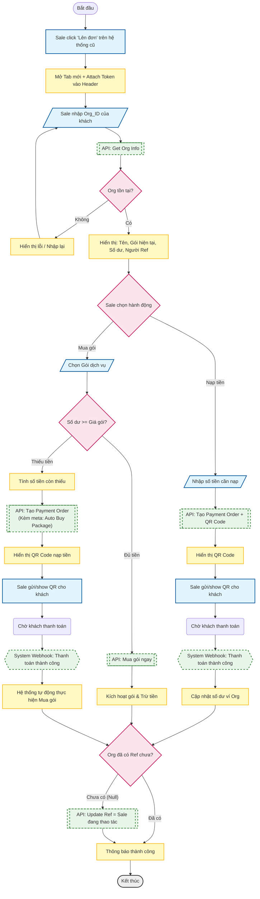
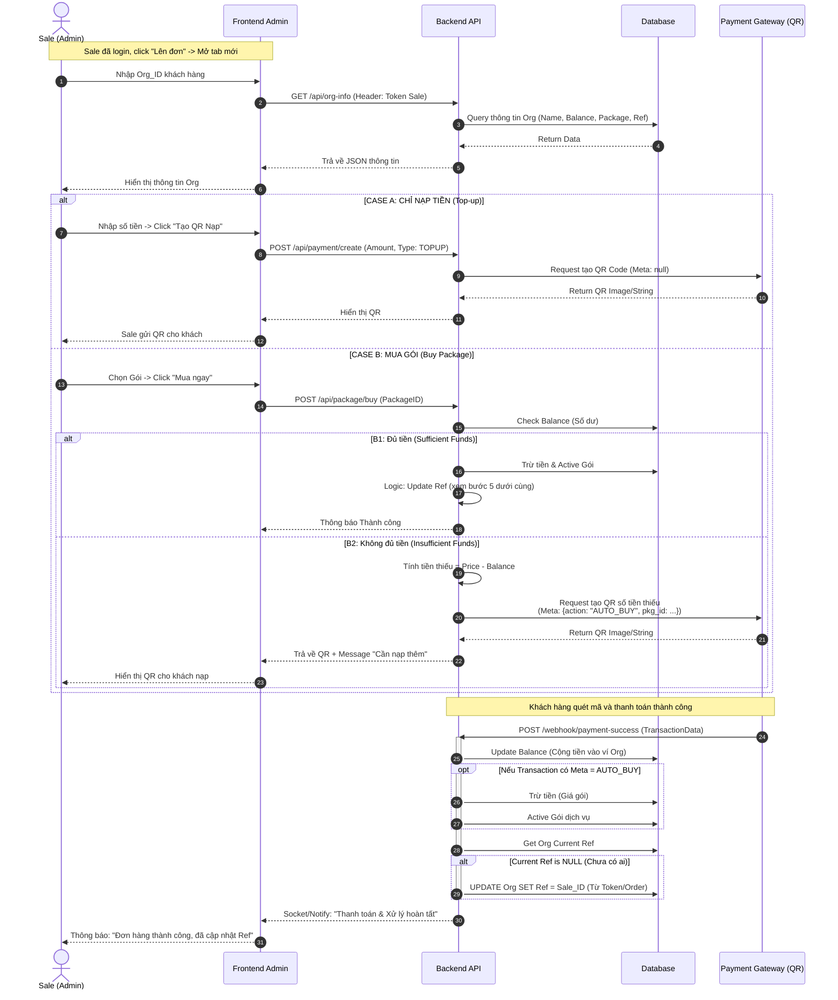

# Form cho sale kích hoạt hộ khách hàng

## flowchart



## sequence diagram



## wireframe

```
1. màn hình chính
+-----------------------------------------------------------------------------+
|  LOGO CRM   |  Trang Lên Đơn Hàng Admin          | Xin chào: Sale Nguyen A  |
+-----------------------------------------------------------------------------+
|                                                                             |
|  1. TÌM KIẾM KHÁCH HÀNG                                                     |
|  +--------------------------------------------------------+  +------------+ |
|  | Nhập Org ID của khách (VD: ORG-10293)                  |  |  KIỂM TRA  | |
|  +--------------------------------------------------------+  +------------+ |
|                                                                             |
| =========================================================================== |
|                                                                             |
|  2. THÔNG TIN KHÁCH HÀNG (Kết quả trả về)                                   |
|  +---------------------------+  +---------------------------+               |
|  |  Tên Org: CÔNG TY ABC     |  |  Số dư ví hiện tại:       |               |
|  |  Gói: FREE TIER           |  |  500.000 VNĐ       [REFRESH]|               |
|  +---------------------------+  +---------------------------+               |
|  |  Người giới thiệu (Ref):  |  |  Trạng thái Ref:          |               |
|  |  [ CHƯA CÓ ] (Cơ hội!)    |  |  (Sẽ gán cho bạn sau khi xong)|           |
|  +---------------------------+  +---------------------------+               |
|                                                                             |
| =========================================================================== |
|                                                                             |
|  3. THAO TÁC (Tab Navigation)                                               |
|  +---------------------+ +---------------------+                            |
|  |  [TAB 1] NẠP TIỀN   | |  [TAB 2] MUA GÓI    | <--- (Đang chọn Tab này)   |
|  +---------------------+ +---------------------+                            |
|  |                                                                          |
|  |  Chọn gói dịch vụ muốn mua cho khách:                                    |
|  |  +--------------------------------------------------+                    |
|  |  | [Dropdown] Gói PRO - 2.000.000 VNĐ / Năm         | v                  |
|  |  +--------------------------------------------------+                    |
|  |                                                                          |
|  |  ---------------- TÍNH TOÁN THANH TOÁN ----------------                  |
|  |  Giá gói:              2.000.000 VNĐ                                     |
|  |  Số dư hiện có:        - 500.000 VNĐ                                     |
|  |                        -------------                                     |
|  |  CẦN NẠP THÊM:         1.500.000 VNĐ                                     |
|  |                                                                          |
|  |  [ Checkbox ] Tự động kích hoạt gói sau khi khách nạp xong               |
|  |                                                                          |
|  |  +-------------------------------------------------------+               |
|  |  |           TẠO QR CODE THANH TOÁN (1.5TR)              |               |
|  |  +-------------------------------------------------------+               |
|  |                                                                          |
+--+--------------------------------------------------------------------------+

2. màn hình chờ thanh toán
+-----------------------------------------------------------------------------+
| (Lớp mờ phía sau - Giao diện chính bị làm mờ)                               |
|                                                                             |
|      +---------------------------------------------------------------+      |
|      |  THANH TOÁN ĐƠN HÀNG                                     [X]  |      |
|      +---------------------------------------------------------------+      |
|      |                                                               |      |
|      |   Vui lòng gửi mã này cho khách hàng (Công ty ABC)            |      |
|      |                                                               |      |
|      |        +---------------------------------------------+        |      |
|      |        |                                             |        |      |
|      |        |              [ HÌNH ẢNH QR CODE ]           |        |      |
|      |        |              (VietQR / Momo...)             |        |      |
|      |        |                                             |        |      |
|      |        +---------------------------------------------+        |      |
|      |                                                               |      |
|      |   Số tiền: 1.500.000 VNĐ                                      |      |
|      |   Nội dung: Nap tien mua goi PRO (ORG-10293)                  |      |
|      |                                                               |      |
|      |   [ Loading Spinner ] Đang chờ khách thanh toán...            |      |
|      |                                                               |      |
|      |   (Hệ thống sẽ tự động đóng popup khi nhận tiền thành công)   |      |
|      |                                                               |      |
|      |   +-----------------------+     +-----------------------+     |      |
|      |   | Copy Link Thanh Toán  |     |   Hủy Bỏ / Làm lại    |     |      |
|      |   +-----------------------+     +-----------------------+     |      |
|      |                                                               |      |
|      +---------------------------------------------------------------+      |
|                                                                             |
+-----------------------------------------------------------------------------+

3. màn hình thanh toán thành công
+-----------------------------------------------------------------------------+
| (Lớp mờ phía sau)                                                           |
|                                                                             |
|      +---------------------------------------------------------------+      |
|      |  GIAO DỊCH THÀNH CÔNG!                                        |      |
|      +---------------------------------------------------------------+      |
|      |                                                               |      |
|      |  (ICON CHECK XANH LỚN)                                        |      |
|      |                                                               |      |
|      |  1. Đã nhận: 1.500.000 VNĐ                                    |      |
|      |  2. Đã kích hoạt gói: PRO (1 năm)                             |      |
|      |  3. Cập nhật REF: Org này đã được gán cho bạn (Nguyen A)      |      |
|      |                                                               |      |
|      |  +-------------------------------------------------------+    |      |
|      |  |                LÊN ĐƠN MỚI                            |    |      |
|      |  +-------------------------------------------------------+    |      |
|      |                                                               |      |
|      +---------------------------------------------------------------+      |
|                                                                             |
+-----------------------------------------------------------------------------+
```
